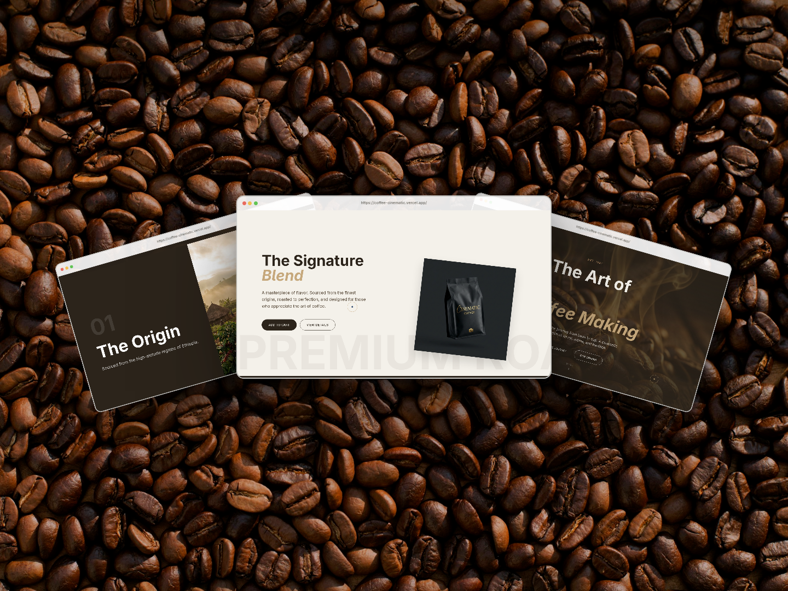

# ☕ Coffee Cinematic



> **Experience Coffee. Visually.**  
> A high-end, immersive digital journey into the art of coffee, crafted with cutting-edge web technologies.

## 📖 Overview

**Coffee Cinematic** is a portfolio-ready web application that reimagines the digital coffee experience. It moves beyond standard e-commerce, offering a sensory-driven interface that combines **cinematic storytelling**, **fluid motion**, and **3D interactivity** to celebrate the craftsmanship behind every cup.

Built with performance and aesthetics in mind, it leverages the latest in React ecosystem capabilities.

## 🚀 Key Features

- **🎥 Cinematic Hero Section**: Immersive video backgrounds with synchronized entrance animations.
- **✨ Advanced Motion System**: Powered by **GSAP** and **Framer Motion** for complex timelines, SplitText reveals, and scroll-triggered effects.
- **🧈 Smooth Scrolling**: Integrated **Lenis** for buttery-smooth inertial scrolling experiences.
- **🧊 3D Elements**: **Three.js** and **React Three Fiber** integration for interactive 3D coffee bean showcases.
- **📱 Fully Responsive**: "Mobile-first" design ensuring a premium experience across all devices.
- **🎨 Modern Styling**: Built with **Tailwind CSS v4** for a robust, maintainable design system.

## 🛠️ Tech Stack

This project uses a modern, high-performance stack:

- **Framework**: [Next.js 16](https://nextjs.org/) (App Router)
- **Core**: [React 19](https://react.dev/) & TypeScript
- **Styling**: [Tailwind CSS v4](https://tailwindcss.com/)
- **Animation**: [GSAP](https://greensock.com/gsap/) & [Framer Motion](https://www.framer.com/motion/)
- **3D Graphics**: [React Three Fiber](https://docs.pmnd.rs/react-three-fiber) (Three.js)
- **Smooth Scroll**: [Lenis](https://lenisFile.com)
- **Icons**: [Lucide React](https://lucide.dev)

## 📦 Getting Started

### Prerequisites

- Node.js 18+
- npm or yarn

### Installation

1.  **Clone the repository**

    ```bash
    git clone https://github.com/your-username/coffee-cinematic.git
    cd coffee-cinematic
    ```

2.  **Install dependencies**

    ```bash
    npm install
    # or
    yarn install
    ```

3.  **Run the development server**

    ```bash
    npm run dev
    ```

4.  **View the application**
    Open [http://localhost:3000](http://localhost:3000) in your browser.

## 🤝 Contributing

Contributions are welcome! If you have suggestions for improvements or new features:

1.  Fork the repository.
2.  Create your feature branch (`git checkout -b feature/AmazingFeature`).
3.  Commit your changes.
4.  Push to the branch.
5.  Open a Pull Request.

## 📄 License

Distributed under the MIT License. See `LICENSE` for more information.

---

_Est. 1987 — Crafted for the love of coffee._
